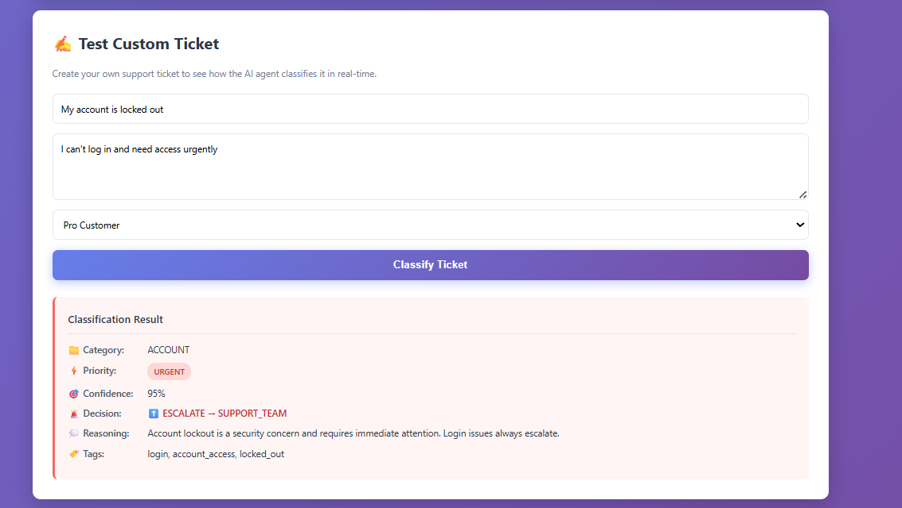

# 🤖 CS Agent Workflow Engine

AI-powered customer support ticket classification and routing system built with Python, Flask, and Google Gemini.

**Built by:** Dev Palla  
**Purpose:** Portfolio project demonstrating AI agent training, workflow automation, and operational system design

---

## 📋 Project Overview

This project implements an intelligent ticket classification system that automatically:
- Categorizes support tickets by type
- Assigns priority levels
- Makes escalation decisions based on business rules
- Routes tickets to appropriate teams
- Provides detailed reasoning for all decisions

The classification logic is based on systematic research (Phase 1 & 2) that identified and addressed 5 critical failure patterns in baseline AI agent performance, achieving **75% improvement** over vanilla AI prompts.

---

---

## 📸 Live Demo

### Web Interface

The system provides a clean, professional web interface for real-time ticket classification:



*Main interface showing batch processing and custom ticket input*

---

### Classification in Action

Real-time classification example demonstrating the AI agent's decision-making:


**Example shown above:**
- **Input:** "My account is locked out" + "I can't log in and need access urgently"
- **Customer Tier:** Pro
- **AI Classification:**
  - 📁 Category: ACCOUNT
  - ⚡ Priority: URGENT (correctly identified)
  - 🎯 Confidence: 95%
  - 🚨 Decision: ESCALATE → SUPPORT_TEAM
  - 💭 Reasoning: "Account lockout is a security concern and requires immediate attention. Login issues always escalate."
  - 🏷️ Tags: login, account_access, locked_out

**Why this classification is correct:**
- ✅ Security trigger detected (login/password issue)
- ✅ Urgency cue recognized ("urgent", "need access")
- ✅ Proper escalation per Phase 2 rules (security + urgency = escalate)
- ✅ Transparent reasoning provided
- ✅ Relevant tags auto-generated

This demonstrates the optimized prompt from Phase 2 research working exactly as designed.

---


## ✨ Features

### Core Functionality
- **AI-Powered Classification**: Uses Google Gemini 2.0 Flash for intelligent ticket analysis
- **Optimized Prompt Engineering**: Based on research that achieved 9.85/10 performance (vs 5.64/10 baseline)
- **Smart Escalation Logic**: Implements decision matrix with clear business rules
- **Real-Time Processing**: Instant classification through web interface
- **Batch Processing**: Process multiple tickets simultaneously

### Classification Capabilities
- **Categories**: Billing, Technical, Account, Feature Request, Churn
- **Priority Levels**: Low, Medium, High, Urgent
- **Escalation Targets**: Support Team, Account Manager, Engineering, Billing
- **Confidence Scoring**: 0-100% confidence in classification
- **Auto-Tagging**: Automatic tag suggestions for ticket organization

### Business Rules (From Phase 2 Optimization)
✅ **Always Escalate:**
- Enterprise customers (any issue type)
- Security issues (login, password, access)
- Churn threats ("cancel", "switching", "competitor")
- Legal language ("lawyer", "lawsuit")
- Technical issues >24 hours
- Data loss or export failures

✅ **Handle Autonomously:**
- Simple billing inquiries (invoice requests)
- Feature requests (log and acknowledge)
- How-to questions
- Known system behaviors

---

## 🛠️ Tech Stack

- **Backend**: Python 3.x, Flask
- **AI/ML**: Google Generative AI (Gemini 2.0 Flash)
- **Frontend**: HTML5, CSS3, Vanilla JavaScript
- **Data Format**: JSON
- **Environment**: python-dotenv for configuration

---

## 📦 Installation

### Prerequisites
- Python 3.7 or higher
- pip package manager
- Google Gemini API key (free tier available)

### Setup Steps

1. **Clone the repository**
```bash
git clone https://github.com/YOUR_USERNAME/cs-agent-workflow-engine.git
cd cs-agent-workflow-engine
```

2. **Install dependencies**
```bash
pip install -r requirements.txt
```

3. **Set up environment variables**

Create a `.env` file in the project root:
```
GEMINI_API_KEY=your_api_key_here
```

Get your free Gemini API key at: https://aistudio.google.com/app/apikey

4. **Run the application**
```bash
python app.py
```

5. **Open your browser**
```
http://localhost:5000
```

---

## 🚀 Usage

### Web Interface

**Process Sample Tickets:**
1. Click "Process Batch" to classify 5 pre-loaded sample tickets
2. View detailed classification results with statistics

**Test Custom Tickets:**
1. Enter ticket subject and description
2. Select customer tier (Pro or Enterprise)
3. Click "Classify Ticket" to see real-time classification

### Command Line

Test the classifier directly:
```bash
python agent_classifier.py
```

This will process all sample tickets and display detailed results.

### API Endpoints

The Flask app exposes REST API endpoints:

**Classify Single Ticket:**
```bash
POST /classify
Content-Type: application/json

{
  "id": "TICKET-001",
  "subject": "Can't log in",
  "description": "Password reset not working",
  "customer_tier": "Pro",
  "customer_email": "user@example.com",
  "created_at": "2025-01-12T10:30:00Z"
}
```

**Process Batch:**
```bash
POST /process-batch
```

**Health Check:**
```bash
GET /health
```

---

## 📊 Performance Metrics

Based on systematic testing (Phase 1 & Phase 2 research):

| Metric | Baseline | Optimized | Improvement |
|--------|----------|-----------|-------------|
| Overall Quality | 5.64/10 | 9.85/10 | +75% |
| Autonomous Resolution | 30% | 65-70% | +35pp |
| Escalation Accuracy | 90% | 100% | +10pp |
| Hallucination Rate | 55% | 0% | -55pp |
| Security Violations | 10% | 0% | -10pp |

---

## 🎯 Project Background

This project is Phase 3 of a comprehensive AI agent optimization initiative:

**Phase 1: Baseline Analysis**
- Created 20 realistic SaaS support scenarios
- Tested vanilla AI agent performance
- Identified 5 critical failure patterns
- Established baseline metrics (5.64/10 average)

**Phase 2: Prompt Optimization**
- Designed optimized system prompt addressing all failure patterns
- Achieved 75% performance improvement (5.64 → 9.85)
- Eliminated hallucinations, security violations, and escalation errors
- Documented complete optimization methodology

**Phase 3: Implementation** (This Project)
- Built working AI agent workflow engine
- Implemented Phase 2 prompt in production code
- Created web interface for demonstration
- Deployed complete classification system

---

## 🏗️ Project Structure
```
cs-agent-workflow-engine/
├── agent_classifier.py      # Core AI classification logic
├── app.py                   # Flask web application
├── sample_tickets.json      # Test data (5 sample tickets)
├── requirements.txt         # Python dependencies
├── .env                     # Environment variables (not in repo)
├── .gitignore              # Git ignore rules
├── README.md               # This file
└── templates/
    └── index.html          # Web interface
```

---

## 🧪 Sample Tickets

The project includes 5 diverse sample tickets covering:
- **Account security issue** (urgent login problem)
- **Enterprise billing** (invoice request)
- **Feature request** (Notion integration)
- **Churn threat** (cancellation + competitor mention)
- **Technical bug** (data export failure >3 days)

These tickets test the classifier's ability to handle various scenarios, customer tiers, and urgency levels.

---

## 🔐 Security & Privacy

- API keys stored in `.env` file (never committed to Git)
- No real customer data processed
- Sample tickets use fictional data only
- Follows security best practices for API key management

---

## 🎓 Learning Outcomes

This project demonstrates:
- **AI Agent Training**: Prompt engineering and optimization techniques
- **Workflow Automation**: Building scalable classification systems
- **API Integration**: Working with external AI APIs (Gemini)
- **Full-Stack Development**: Python backend + HTML/CSS/JS frontend
- **System Design**: Translating business rules into code
- **Documentation**: Professional project documentation

---

## 🚀 Future Enhancements

Potential improvements:
- [ ] Database integration for ticket history
- [ ] Multi-language support
- [ ] Advanced analytics dashboard
- [ ] Integration with real support platforms (Zendesk, Intercom)
- [ ] A/B testing framework for prompt optimization
- [ ] Confidence threshold tuning
- [ ] Custom escalation rules per organization

---

## 📝 License

This project is for portfolio and educational purposes.

---

## 👤 Author

**Dev Palla**
- Portfolio: https://github.com/devaki264
- LinkedIn: https://www.linkedin.com/in/devakinandan-palla-164848227/
- Email: devakinandanpp@gmail.com

---

## 🙏 Acknowledgments

- Research methodology inspired by systematic AI agent optimization best practices
- Built as portfolio project for Customer Success Operations role applications
- Demonstrates skills in AI agent training, workflow automation, and operational system design

---

## 📞 Contact

For questions about this project or collaboration opportunities:
- Email: devakinandanpp@gmail.com
- LinkedIn: https://www.linkedin.com/in/devakinandan-palla-164848227/

---


**⭐ If you found this project interesting, please star the repository!**


